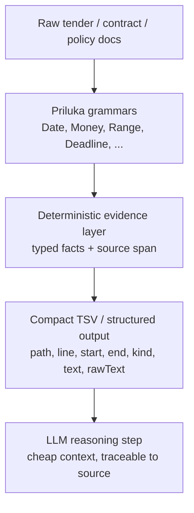

# Priluka

Priluka is a deterministic evidence layer for AI pipelines that need to extract facts from large, messy documents before an LLM does any reasoning.

It is not trying to replace LLMs. It is trying to make them safer, cheaper, and more accurate on long procurement, legal, finance, and compliance documents by turning raw text into compact, traceable evidence.

Pre-1.0 note: the API is still evolving, but the architecture and evidence pipeline are already stable enough to evaluate.

## The Problem

Large document packages are expensive and fragile to process with an LLM directly.

- The documents are often huge: tens or hundreds of megabytes per package.
- Facts are scattered across long, noisy text.
- LLMs lose recall on long context and can miss dates, amounts, and ranges.
- Full-document extraction is slow and expensive.
- A hallucinated fact is worse than a missed search hit because it is hard to verify.

Priluka addresses that by extracting a compact fact layer first, then letting the LLM reason over a small, structured evidence set instead of the entire corpus.

## The Pipeline



The important idea is that the LLM no longer has to rediscover facts from the entire document. It receives a short, auditable list of candidate facts with provenance.

## Why This Exists

This is the middle layer that is missing between chunking-RAG and full LLM extraction.

- Chunking-RAG is good for retrieval, but it is not exhaustive fact extraction.
- LLM-only extraction is flexible, but it is expensive and can miss precise facts.
- Regex-only approaches are too brittle once documents get structurally messy.

Priluka is designed for the use case where recall, precision, and provenance all matter.

## What Priluka Gives You

- Deterministic matching of structured facts in raw text.
- Typed grammar definitions in ordinary Java classes.
- Bounded gap patterns such as `@Occurrences(max = 6) Word[]` for evidence phrases.
- Hard-boundary guards with `@NoHardBoundary` on extraction roots or constructor parameters.
- Evidence with provenance: every hit can carry source location and matched text.
- A compact output shape that is ready for downstream indexing, deduplication, or LLM reasoning.
- A path from one grammar to many composable grammars, instead of one giant handwritten parser.

## Evidence With Provenance

The test playground currently writes evidence rows with this shape:

```text
path    line    start    end    kind    text    rawText
```

That is the feature that matters most for AI workflows.

- `path` identifies the source document.
- `line` points to the readable location.
- `start` and `end` give character offsets for exact replay.
- `kind` gives a normalized fact type.
- `text` and `rawText` keep the extracted span visible and auditable.

This makes the output useful for:

- RAG pre-processing
- agent tool calls
- compliance review
- contract review
- human-in-the-loop validation

## Architecture

Priluka is intentionally split into two layers:

1. Grammar discovery
2. Parsing and evidence extraction

### 1) Grammar Discovery

Priluka reads a class universe and builds an internal grammar model from Java classes and annotations.

The public entry points are:

- `Parser.init(...)`
- `Parser.initFromOuterClass(...)`
- `Parser.builder()...build()`
- `Parser.describe(...)`

The grammar model can then be inspected as BNF-like output and analyzed for prediction conflicts and NFA compatibility.

### 2) Parsing and Search

Once the grammar is known, Priluka can:

- `parse(...)` a complete input into a typed Java object
- `trace(...)` the accepted derivation with token spans
- `buildFromTrace(...)` reconstruct an object from a trace
- `find(...)` and `findAll(...)` search inside larger documents

The internal runtime has a few important pieces:

- a lexer layer with configurable terminal sets and skip tokens
- a parser layer that selects the fastest compatible path when possible
- a reflective fallback parser for grammars outside the fast subset
- a token-level `find` engine that can run with NFA or DFA style search
- typed parse traces for replay and provenance

## What This Looks Like in Practice

The sibling playground project already uses Priluka on real tender caches to extract:

- dates
- date ranges
- deadline statements
- money amounts
- money ranges
- thresholds
- percentages
- insurance limits

Those grammars are built to surface facts from procurement-style text, which is exactly the kind of corpus where deterministic evidence extraction is valuable.

The reusable evidence grammars currently live in:

- `io.github.ukman.priluka.evidence.DateGrammar`
- `io.github.ukman.priluka.evidence.MoneyGrammar`

The playground also writes TSV outputs and package summaries so you can inspect:

- what matched
- where it matched
- how many distinct facts were found
- which packages are richest in evidence

## Why the Architecture Is Useful for AI

The main value is not just speed.

The main value is that the evidence layer is:

- deterministic
- typed
- inspectable
- auditable
- easy to hand to an LLM

That means an AI pipeline can do this:

1. Scan a large corpus with Priluka.
2. Deduplicate and normalize the extracted evidence.
3. Give the LLM only the compact evidence set.
4. Ask the LLM to reason, summarize, compare, or answer questions using source-backed facts.

This is a much better failure mode than asking an LLM to infer everything from raw long-form input.

## Quick Start

```java
public final class Example {
    public static void main(String[] args) {
        // Illustrative only: replace ExampleFact with your own grammar root.
        ExampleFact fact = Parser.parse(ExampleFact.class, "raw text");
    }
}
```

For larger workflows:

```java
Parser.InitializedParser parser = Parser
    .builder()
    .classes(ExampleFact.class, ExampleMoney.class, ExampleDate.class)
    .caseInsensitive()
    .build();

List<ParseFindResult<ExampleMoney>> moneyHits = parser.findAll(ExampleMoney.class, documentText);
ParseTraceResult<ExampleFact> parsed = parser.trace(ExampleFact.class, documentText);
```

## Bundled Evidence Grammars

Priluka now ships the first reusable evidence grammars for document-heavy workflows:

- `Date`
- `DateRange`
- `DeadlineEvidence`
- `Money`
- `MoneyRange`
- `MoneyThreshold`
- `InsuranceLimit`

`MoneyGrammar` supports common prefix/suffix currency forms including GBP, USD,
EUR, CAD, AUD, NZD, JPY, CNY, SAR, CHF, Nordic currencies, European currencies
such as PLN, CZK, HUF, RON, BGN, UAH, GEL, TRY, and related word forms like
`Canadian dollars`, `Swiss francs`, and `Norwegian kroner`.

These are the kinds of facts that procurement and legal documents repeatedly express in many surface forms.

## Benchmarks

The playground project currently contains real corpus scans and synthetic evidence benchmarks over tender-style documents.

Benchmark context: measured on a 2015 iMac with a 4 GHz quad-core Intel i7.

NFA is the general-purpose engine; DFA is the optimized path for compatible search grammars. DFA compilation is treated as parser startup cost and is excluded from throughput.

Latest synthetic benchmark from `SyntheticEvidenceBenchmark` on a 20 MiB generated corpus, run on June 21, 2026:

```text
target         engine  matches  prepare  warmup  avg scan  speed
date           NFA     34       0.05s    10.43s  4.70s     4.25 MiB/s
date           DFA     34       0.27s    2.32s   1.20s     16.64 MiB/s

date-evidence  NFA     35       0.10s    12.98s  5.90s     3.39 MiB/s
date-evidence  DFA     35       3.94s    2.26s   0.93s     21.54 MiB/s

deadline       NFA     10       0.08s    7.30s   3.75s     5.33 MiB/s
deadline       DFA     10       6.50s    3.70s   1.84s     10.90 MiB/s

money          NFA     14       0.02s    5.85s   2.44s     8.19 MiB/s
money          DFA     14       0.08s    3.94s   1.92s     10.43 MiB/s
```

The command used a single parser instance per grammar target:

```bash
mvn -q compile exec:java \
  -Dexec.mainClass=io.github.ukman.priluka.test.SyntheticEvidenceBenchmark \
  -DtargetBytes=20971520 \
  -Dinsertions=50 \
  -DwarmupRuns=2 \
  -DmeasuredRuns=3
```

The `prepare` column forces recognizer construction before timing. For DFA it includes automaton compilation, which should happen once when the parser is initialized and then be reused across a package or corpus. The `avg scan` column is the average of three measured passes after warmup and is the throughput number that matters for long-running extraction.

This is the strongest current speed signal: the DFA path reaches about 10 to 22 MiB/s on these grammar families while matching the same number of hits as the NFA comparison path. In practice, that means the DFA path keeps the same recall and precision on these benchmarks while running several times faster on the harder grammars.

Focused deadline-only run on the same 20 MiB generated string:

```bash
mvn -q compile exec:java \
  -Dexec.mainClass=io.github.ukman.priluka.test.SyntheticEvidenceBenchmark \
  -Dtarget=deadline \
  -Dengine=DFA \
  -DtargetBytes=20971520 \
  -Dinsertions=50 \
  -DwarmupRuns=5 \
  -DmeasuredRuns=5
```

```text
target    engine  matches  prepare  warmup   avg scan  speed
deadline  DFA     10       8.49s    8.61s    1.78s     11.21 MiB/s
```

This run is a single 20 MiB string, not a small file scan. The DFA `prepare`
cost is startup cost for one parser/target; the hot scan is the reusable
throughput number. This is public `findAll(...)` throughput, so it includes
lexing and trace/object reconstruction for accepted spans, not only pure DFA
span scanning.

For a real-corpus reference point, deadline extraction on a 5 MiB golden tender subset found 16 matches and 12 distinct evidence strings, with scan-only speed around 0.37 MiB/s on that older general-purpose path.

Scanning 20 MiB this way is effectively negligible compute on a single machine; sending the same volume through an LLM API would usually cost materially more and add minutes of latency.

The corpus-based runs on real procurement documents, including date ranges, deadlines, and money evidence, are still useful for proving recall and provenance on actual tender text, but the synthetic benchmark above is the cleanest current speed signal.

## Known Limitations

Priluka is still a prototype, and it is better to say that clearly.

- Whitespace is currently ignored between lexemes, so some matches can cross line breaks.
- Nested `Date` parsing still has expensive sub-parses in some range constructions.
- Some money handling still relies on post-filtering to reject bad adjacent punctuation cases.
- Ambiguity reporting for multiple accepting NFA paths is not finished yet.

These are acceptable tradeoffs for a prototype, and they are the kind of tradeoffs that should be visible rather than hidden.

## Current Direction

The direction is to make Priluka a practical deterministic preprocessing layer for AI systems operating on large document sets.

That means:

- keep the Java-native grammar model compact
- keep provenance visible in the output
- add domain grammars that cover real procurement and contract facts
- preserve a clean handoff from evidence extraction to LLM reasoning

The long-term value is not “another parser generator”.
The long-term value is “structured evidence first, LLM reasoning second”.

## Build

```bash
mvn test
```

## Project Structure

- `src/main/java` - library code
- `src/test/java` - unit tests
- `src/main/resources` - resources
- `src/test/resources` - test resources
