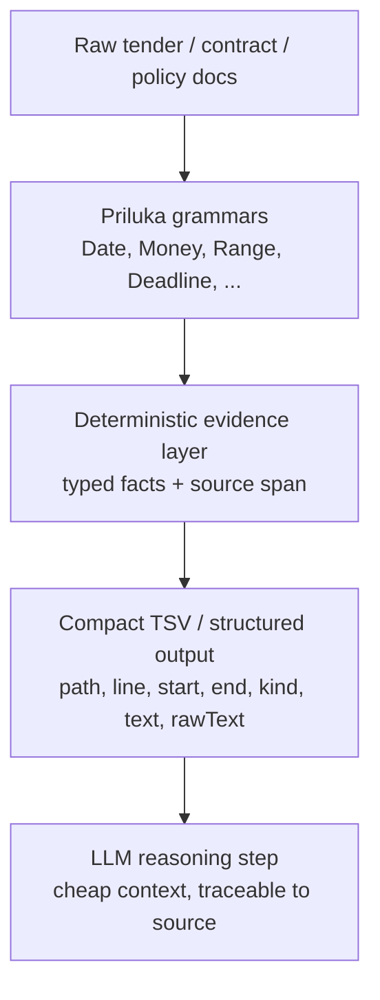

# Priluka

Priluka is a deterministic evidence layer for AI pipelines that need to extract facts from large, messy documents before an LLM does any reasoning.

It is not trying to replace LLMs. It is trying to make them safer, cheaper, and more accurate on long procurement, legal, finance, and compliance documents by turning raw text into compact, traceable evidence.

Pre-1.0 note: the API is still evolving, but the architecture and evidence pipeline are already stable enough to evaluate.

**Who this is for:** Priluka is a JVM-native library. Grammars are plain Java classes, so it fits naturally into pipelines that already run on the JVM. If your stack is Python-first, you can still call Priluka as a subprocess or service, but grammar authoring itself is Java-only by design.

## The Problem

Large document packages are expensive and fragile to process with an LLM directly.

- The documents are often huge: tens or hundreds of megabytes per package.
- Facts are scattered across long, noisy text.
- LLMs lose recall on long context and can miss dates, amounts, and ranges.
- Full-document extraction is slow and expensive.
- A hallucinated fact is worse than a missed search hit because it is hard to verify.

Priluka addresses that by extracting a compact fact layer first, then letting the LLM reason over a small, structured evidence set instead of the entire corpus.

## The Pipeline



The important idea is that the LLM no longer has to rediscover facts from the entire document. It receives a short, auditable list of candidate facts with provenance.

## Why This Exists

This is the middle layer that is missing between chunking-RAG and full LLM extraction.

- Chunking-RAG is good for retrieval, but it is not exhaustive fact extraction.
- LLM-only extraction is flexible, but it is expensive and can miss precise facts.
- Regex-only approaches are too brittle once documents get structurally messy.

Priluka is designed for the use case where recall, precision, and provenance all matter.

## What Priluka Gives You

- Deterministic matching of structured facts in raw text.
- Typed grammar definitions in ordinary Java classes.
- Evidence with provenance: every hit can carry source location and matched text.
- A compact output shape that is ready for downstream indexing, deduplication, or LLM reasoning.
- A path from one grammar to many composable grammars, instead of one giant handwritten parser.

## Evidence With Provenance

The test playground currently writes evidence rows with this shape:

```text
path    line    start    end    kind    text    rawText
```

That is the feature that matters most for AI workflows.

- `path` identifies the source document.
- `line` points to the readable location.
- `start` and `end` give character offsets for exact replay.
- `kind` gives a normalized fact type.
- `text` and `rawText` keep the extracted span visible and auditable.

This makes the output useful for:

- RAG pre-processing
- agent tool calls
- compliance review
- contract review
- human-in-the-loop validation

## Architecture

Priluka is intentionally split into two layers:

1. Grammar discovery
2. Parsing and evidence extraction

### 1) Grammar Discovery

Priluka reads a class universe and builds an internal grammar model from Java classes and annotations.

The public entry points are:

- `Parser.init(...)`
- `Parser.initFromOuterClass(...)`
- `Parser.builder()...build()`
- `Parser.describe(...)`

The grammar model can then be inspected as BNF-like output and analyzed for prediction conflicts and NFA compatibility.

### 2) Parsing and Search

Once the grammar is known, Priluka can:

- `parse(...)` a complete input into a typed Java object
- `trace(...)` the accepted derivation with token spans
- `buildFromTrace(...)` reconstruct an object from a trace
- `find(...)` and `findAll(...)` search inside larger documents

The internal runtime has a few important pieces:

- a lexer layer with configurable terminal sets and skip tokens
- a parser layer that selects the fastest compatible path when possible
- a reflective fallback parser for grammars outside the fast subset
- a token-level `find` engine that can run with NFA or DFA style search
- typed parse traces for replay and provenance

## How This Differs From Existing Rule Engines

Priluka is not the first attempt at deterministic, rule-based extraction. GATE's JAPE, UIMA RUTA, and Stanford's TokensRegex all solve a related problem, and any of them may already fit your use case.

The difference is where the rules live. JAPE, RUTA, and TokensRegex define rules as external script or DSL files, interpreted at runtime, usually outside your main codebase and its type system. Priluka grammars are ordinary Java classes: composable, type-checked at compile time, and able to produce typed objects directly instead of annotation spans you re-parse yourself afterward.

That is a tradeoff, not a strict improvement. If you need non-developers to author or edit extraction rules without touching Java, a standalone DSL like RUTA or JAPE is the better fit. If your pipeline already lives in Java or Kotlin and you want grammars to behave like normal application code, with IDE support, refactoring, and unit tests, Priluka is built for that case specifically.

## What This Looks Like in Practice

The sibling playground project already uses Priluka on real tender caches to extract:

- dates
- date ranges
- deadline statements
- money amounts
- money ranges
- thresholds
- percentages
- insurance limits

Those grammars are built to surface facts from procurement-style text, which is exactly the kind of corpus where deterministic evidence extraction is valuable.

The playground also writes TSV outputs and package summaries so you can inspect:

- what matched
- where it matched
- how many distinct facts were found
- which packages are richest in evidence

## Why the Architecture Is Useful for AI

The main value is not just speed.

The main value is that the evidence layer is:

- deterministic
- typed
- inspectable
- auditable
- easy to hand to an LLM

That means an AI pipeline can do this:

1. Scan a large corpus with Priluka.
2. Deduplicate and normalize the extracted evidence.
3. Give the LLM only the compact evidence set.
4. Ask the LLM to reason, summarize, compare, or answer questions using source-backed facts.

This is a much better failure mode than asking an LLM to infer everything from raw long-form input.

## Quick Start

```java
public final class Example {
    public static void main(String[] args) {
        // Illustrative only: replace ExampleFact with your own grammar root.
        ExampleFact fact = Parser.parse(ExampleFact.class, "raw text");
    }
}
```

For larger workflows:

```java
Parser.InitializedParser parser = Parser
    .builder()
    .classes(ExampleFact.class, ExampleMoney.class, ExampleDate.class)
    .caseInsensitive()
    .build();

List<ParseFindResult<ExampleMoney>> moneyHits = parser.findAll(ExampleMoney.class, documentText);
ParseTraceResult<ExampleFact> parsed = parser.trace(ExampleFact.class, documentText);
```

## Planned Example Bundle

The intended public story is to ship Priluka with ready-to-use evidence grammars for document-heavy workflows.

Good first bundled examples are:

- `Date`
- `DateRange`
- `DeadlineEvidence`
- `Money`
- `MoneyRange`
- `MoneyThreshold`
- `InsuranceLimit`

These are the kinds of facts that procurement and legal documents repeatedly express in many surface forms.

## Benchmarks

The benchmark report in `benchmark.md` is a JMH `AverageTime` run for
`MoneyGrammar.findAll(...)` on deterministic synthetic text.

It was run single-threaded with one fork and one warmup/measurement setup on a
`Standard_D2s_v5` Azure VM in `westus2` running Ubuntu 24.04 and OpenJDK 17.

The headline result for the current implementation is about `14-17 MiB/s` on
this DFA `findAll(...)` benchmark, with the 20 MiB case landing around
`15.89 MiB/s`.

```text
5 MiB   16.99 MiB/s
10 MiB  16.95 MiB/s
20 MiB  15.89 MiB/s
30 MiB  14.75 MiB/s
40 MiB  13.51 MiB/s
```

The benchmark can be rerun with the helper script from `benchmark.md`:

```bash
./scripts/run-money-findall-dfa-jmh.sh \
  io.github.ukman.priluka.benchmark.MoneyFindAllDfaBenchmark \
  -p sizeMiB=5,10,20,30,40 \
  -wi 1 \
  -i 1 \
  -f 1 \
  -t 1
```

This is the strongest current speed signal: the DFA path keeps the same hit
count as the slower comparison path, so the benchmark is about throughput, not
recall tradeoff.

The full benchmark report in `benchmark.md` has the detailed setup and the
additional runs.

This benchmark measures the full public `findAll(...)` path on deterministic
synthetic text, so the throughput includes lexing and result reconstruction for
accepted spans, not only the raw DFA walk.

Scanning 20 MiB this way is effectively negligible compute; sending the same volume through an LLM API would usually cost materially more and add minutes of latency.

The corpus-based runs on real procurement documents, including date ranges, deadlines, and money evidence, are still useful for proving recall and provenance on actual tender text, but the synthetic benchmark above is the cleanest current speed signal.

## Known Limitations

Priluka is still a prototype, and it is better to say that clearly.

- Whitespace is currently ignored between lexemes, so some matches can cross line breaks.
- Nested `Date` parsing still has expensive sub-parses in some range constructions.
- Some money handling still relies on post-filtering to reject bad adjacent punctuation cases.
- Ambiguity reporting for multiple accepting NFA paths is not finished yet.

These are acceptable tradeoffs for a prototype, and they are the kind of tradeoffs that should be visible rather than hidden.

## Current Direction

The direction is to make Priluka a practical deterministic preprocessing layer for AI systems operating on large document sets.

That means:

- keep the Java-native grammar model compact
- keep provenance visible in the output
- add domain grammars that cover real procurement and contract facts
- preserve a clean handoff from evidence extraction to LLM reasoning

The long-term value is not “another parser generator”.
The long-term value is “structured evidence first, LLM reasoning second”.

## Build

```bash
mvn test
```

## Project Structure

- `src/main/java` - library code
- `src/test/java` - unit tests
- `src/main/resources` - resources
- `src/test/resources` - test resources
